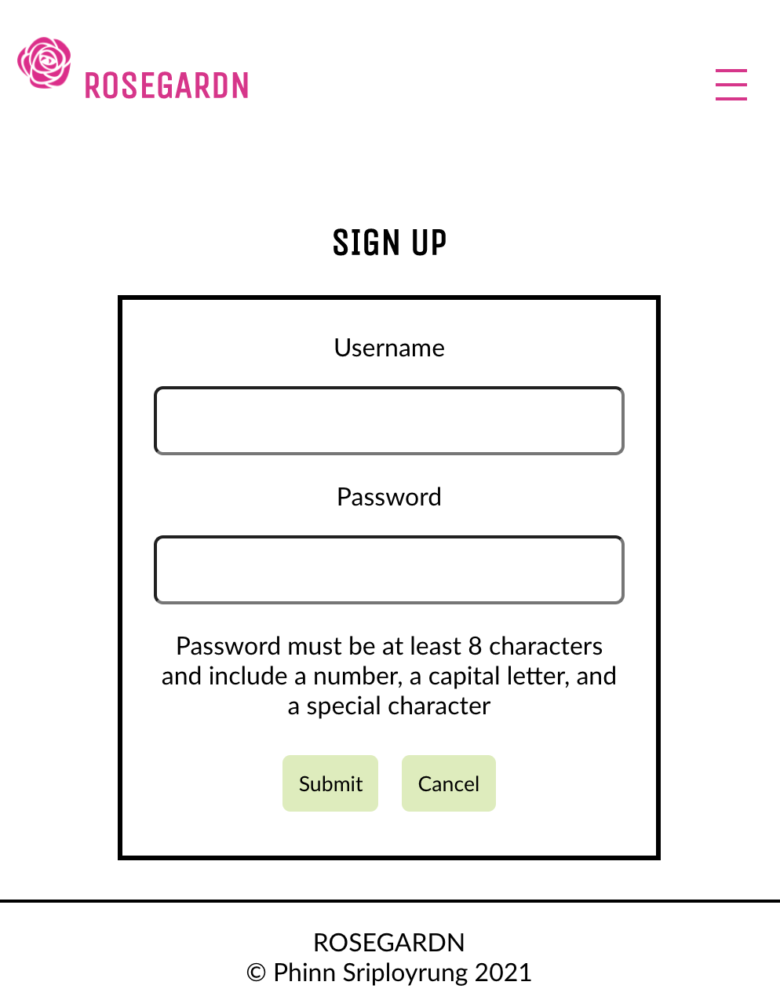
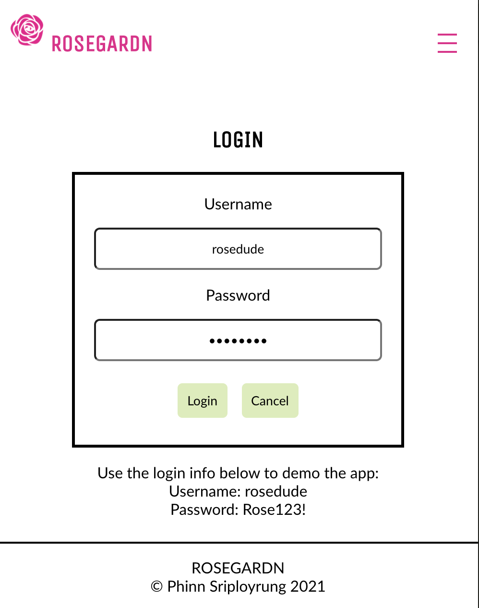

<!-- ABOUT THE PROJECT -->

## About The Project

  

ROSEGARDN is an app for rosarians, obsessed rose addicts and casual rose enthusiasts to share and keep track of the roses in their gardens.

In the ROSEGARDN users can add their roses and keep a log of activities for each rose. No more guessing when you last watered, fertilized or pruned your roses.

[Check out the live app here.](https://rose-gardn-app.vercel.app/)

### Built With

- [HTML](https://developer.mozilla.org/en-US/docs/Web/HTML)
- [CSS](https://developer.mozilla.org/en-US/docs/Web/CSS)
- [JavaScript](https://www.javascript.com/)
- [React](https://reactjs.org/docs/getting-started.html)
- [Node.js](https://nodejs.org/en/docs/)
- [Express](https://expressjs.com/)
- [PostgreSQL](https://www.postgresql.org/)
- [Knex](http://knexjs.org/)

<!-- SCREEN SHOTS -->

## Screen Shots

### Homepage desktop view

### Sign up page mobile view

### Login page mobile view

### Roses and Logs Demo mobile view

## Roadmap

See the [open issues](https://github.com/sriphinn/rose-gardn/issues) for a list of proposed features (and known issues).

## Contact

psrip001@gmail.com

Portfolio: https://phinn.dev

Project Link: [https://github.com/sriphinn/rose-gardn](https://github.com/sriphinn/rose-gardn)

Project API Link: [https://github.com/sriphinn/rose-gardn-api](https://github.com/sriphinn/rose-gardn-api)